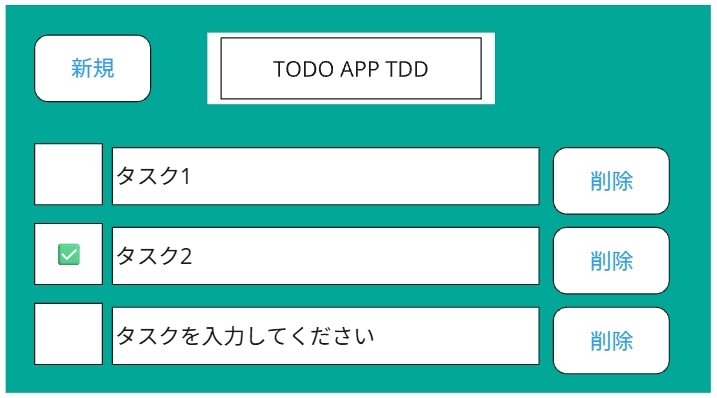

# TODOアプリ

## 1. フロントエンド

- 新規​（Create）​
  - 「新規」​押下で​新しい​行が​追加される。​
- ​一覧​表示​（Read）​
- チェック​（Update）​
  - ※タスク名の​更新は​削除と​新規で​実現
- 削除​（Delete）​

※​テストは​作成しない。​

## 1. バックエンド

- 新規(Create)
  - メソッド：POST
  - エンドポイント：`/api/v1/tasks`
  - 機能：リクエスト内容をJSONファイルに書き出し
- 一覧表示(Read)
  - メソッド：GET
  - エンドポイント：`/api/v1/tasks`
  - 機能：JSONファイルの全内容を返却
- チェック(Update)
  - メソッド：PATCH
  - エンドポイント：`/api/v1/tasks/{id}`
  - 機能：status の 0/1 を更新
- 削除(Delete)
  - メソッド：DELETE
  - エンドポイント：`/api/v1/tasks/{id}`
  - 機能：指定されたidのdeletedをtrueに更新

※データはDBでなくJSONファイルで管理。

### JSON仕様

| 要素名 | 型 | 制約 |
| --- | --- | --- |
| id | int(20) | not null PK auto increment |
| name | varchar(40) | not null |
| status | int(1) | not null default 0 |
| created | timestamp | not null |
| updated | timestamp | not null |
| deleted | bool | not null default false |
